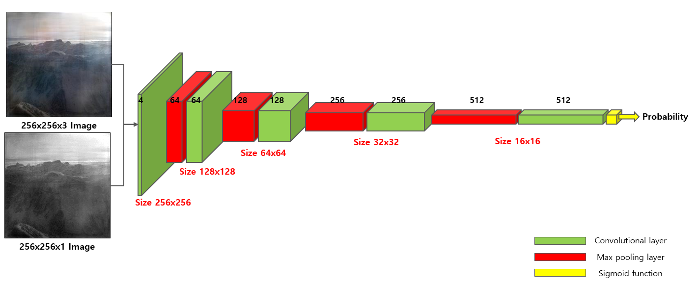

## Infrared image colorization based on an unbalanced dcgan ##

---------------------------------------

### Requirments
* nvidia gtx1080 11GB
* ubuntu 16.04 LTS
* python version = 3.xx
* backend: Tensorflow 1.7
* keras

---------------------------------------

### Model
#### GAN

#### generator

#### discriminator

---------------------------------------

### Performance
* 64x64 to 256*256 size image

#### inference GPU
* nvidia gtx1080 11GB
* keras (backend tensorflow)

time(msec)|(A)|(B)|(C)|(D)
---|:---:|---:|---:|---:
inference|5.035|7.127|4.110|5.260

#### inference CPU
* intel core i7-7500U
(TODO)

---------------------------------------

### Result
#### NIR (near infrared) images

#### FIR (far infrared) images

