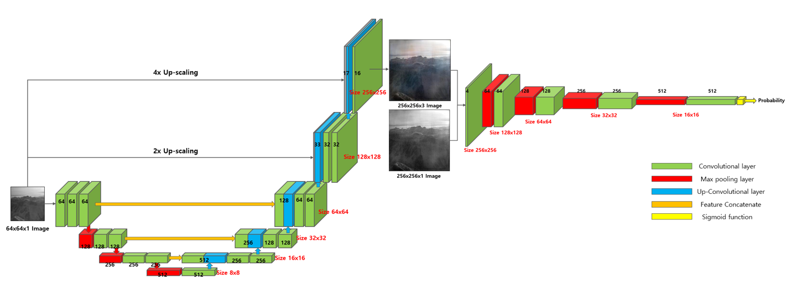
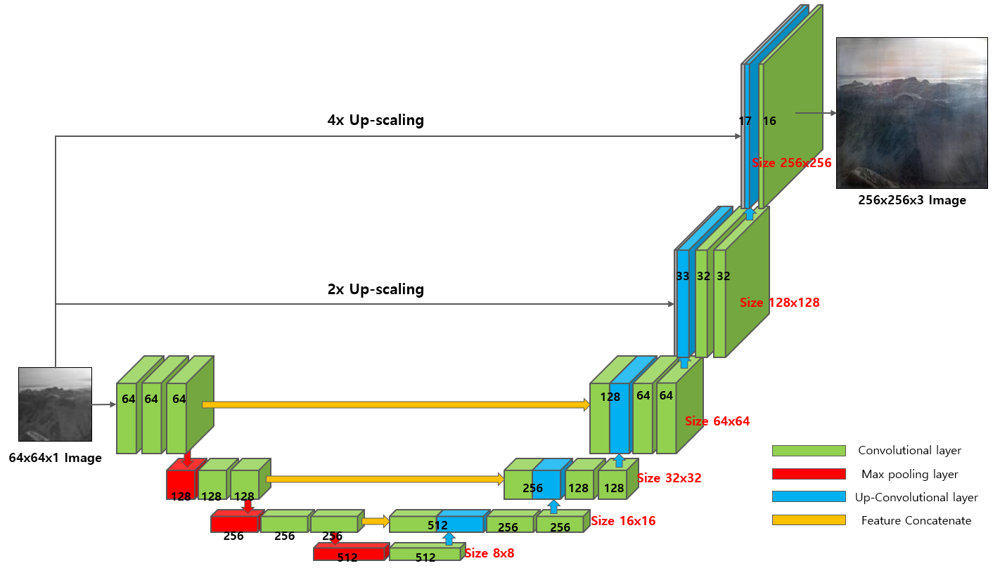
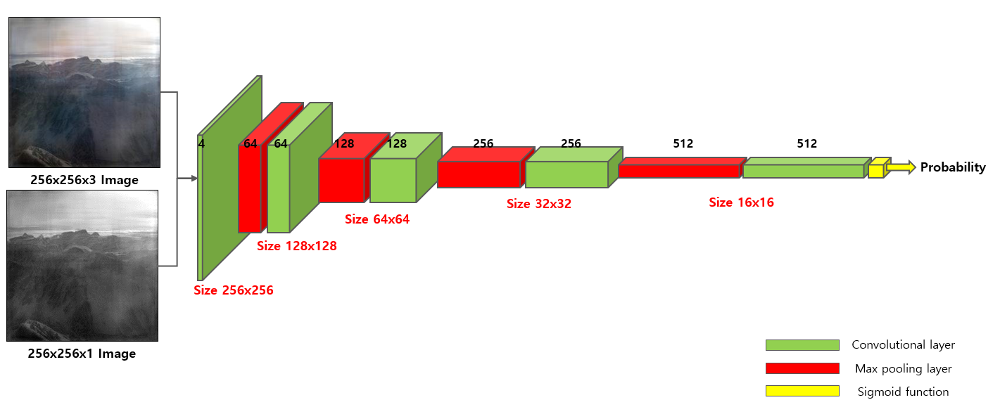
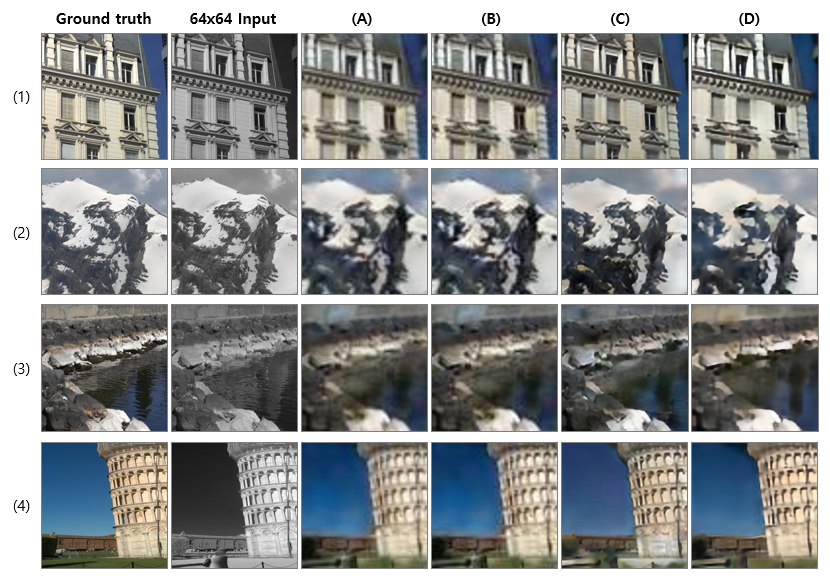
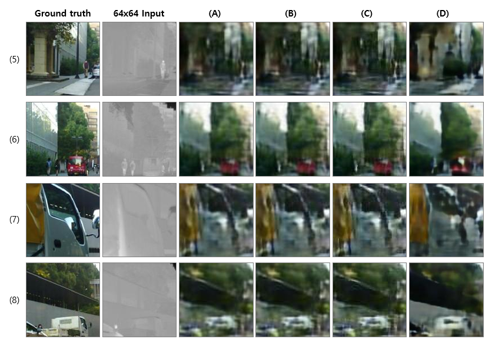

# Infrared image colorization based on an unbalanced DCGAN #

## 1. Environment
* Python 3.6
* Tensorflow 1.7

## 2. Model
### 2.1 GAN

### 2.2 Generator

### 2.3 Discriminator

## 3. Performance
* 64x64 to 256x256 size image
* (A) : bilinear interpolation + Colorization
* (B) : bicubic interpolation + Colorization
* (C) : FSRCNN super-resolution + Colorization
* (D) : Unbalanced DCGAN

### 3.1 Inference GPU
* NVIDIA GTX1080 11GB
* Keras (backend tensorflow)

Time(msec)|(A)|(B)|(C)|(D)
:---:|:---:|:---:|:---:|:---:
Inference|5.035|7.127|4.110|5.260

### 3.2 Inference CPU
* Intel core i7-7500U(TODO)

Time(msec)|(A)|(B)|(C)|(D)
:---:|:---:|:---:|:---:|:---:
Inference|TODO|TODO|TODO|150.059

## 4. Result
64x64x1 infrared image to 256x256x3 RGB image
### 4.1 NIR (Near infrared) images

### 4.2 FIR (Far infrared) images

